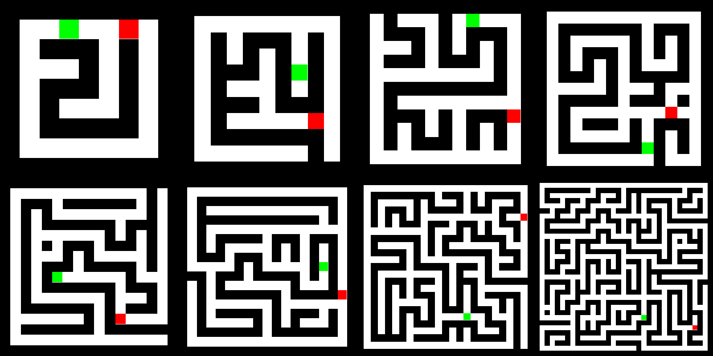
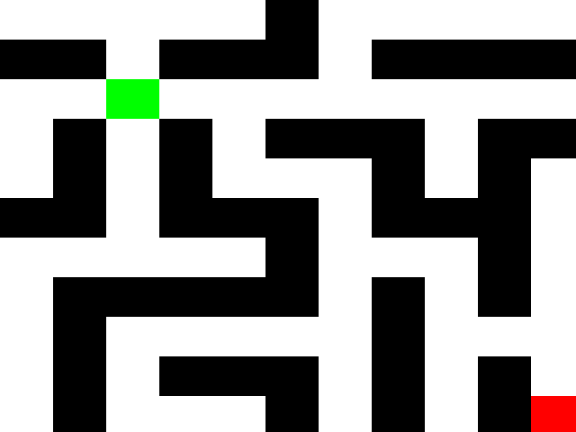
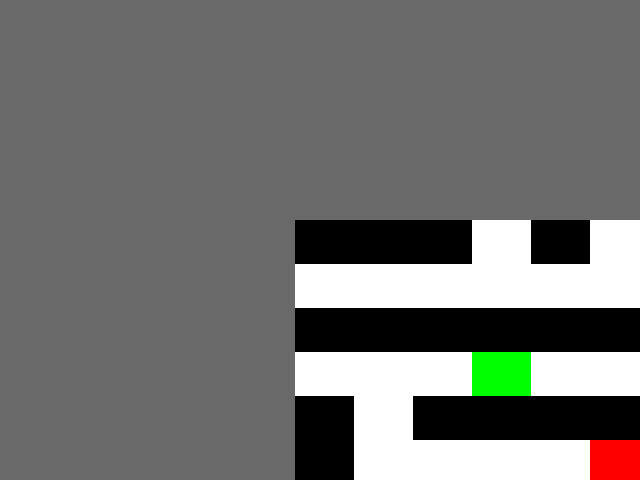
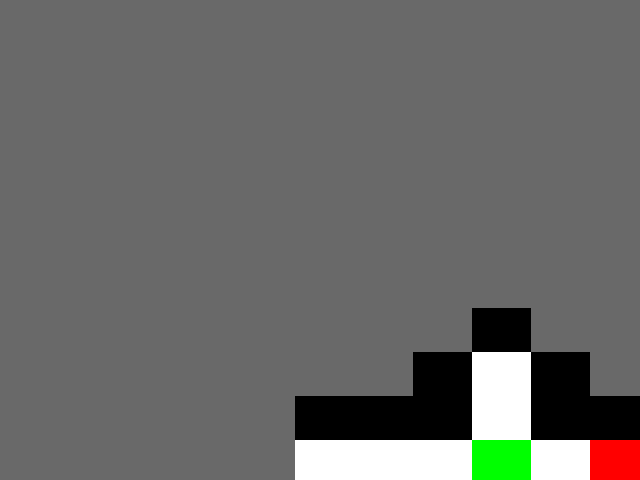

# Maze environment for GYM


## Installation
```bash
pip install git+https://github.com/cair/gym-maze.git
```

## Basic Usage
```python
import gym
import gym_maze # This is required in order to load gym-maze

if __name__ == '__main__':
    

    # Reset environment
    env = gym.make("Maze-Arr-5x5-POMDPMaze-v0")
    s = env.reset()

    # Set terminal state to false
    terminal = False

    while not terminal:
        # Draw environment on screen
        env.render()  # For image you MUST call this

        # Draw action from distribution
        a = env.action_space.sample()

        # Perform action in environment
        s1, r, t, _ = env.step(a)
        terminal = t

        s = s1
```

## Available Environments
There are several configurations available for gym-maze.

### Fully Observable Maze
Everything is shown, no hidden information


### Partially Observable Maze
A small area around the player is shown, rest is hidden


### Limited Partially Observable Maze
Only the logical vision (Cannot see past walls #collison)


### Timed Limited Partially Observable Maze
The whole maze is initially shown, After X timesteps, the maze is hidden


### Environment List
A complete list of environments han be seen [here](./documentation/env_list.md)

## Licence
Copyright 2017 Per-Arne Andersen

Permission is hereby granted, free of charge, to any person obtaining a copy of this software and associated documentation files (the "Software"), to deal in the Software without restriction, including without limitation the rights to use, copy, modify, merge, publish, distribute, sublicense, and/or sell copies of the Software, and to permit persons to whom the Software is furnished to do so, subject to the following conditions:

The above copyright notice and this permission notice shall be included in all copies or substantial portions of the Software.

THE SOFTWARE IS PROVIDED "AS IS", WITHOUT WARRANTY OF ANY KIND, EXPRESS OR IMPLIED, INCLUDING BUT NOT LIMITED TO THE WARRANTIES OF MERCHANTABILITY, FITNESS FOR A PARTICULAR PURPOSE AND NONINFRINGEMENT. IN NO EVENT SHALL THE AUTHORS OR COPYRIGHT HOLDERS BE LIABLE FOR ANY CLAIM, DAMAGES OR OTHER LIABILITY, WHETHER IN AN ACTION OF CONTRACT, TORT OR OTHERWISE, ARISING FROM, OUT OF OR IN CONNECTION WITH THE SOFTWARE OR THE USE OR OTHER DEALINGS IN THE SOFTWARE.

